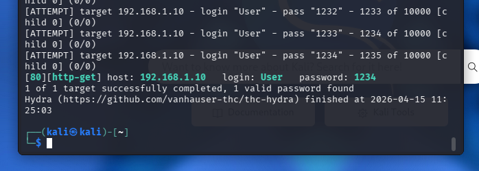
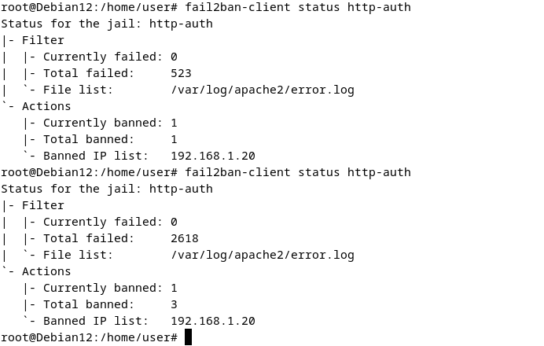
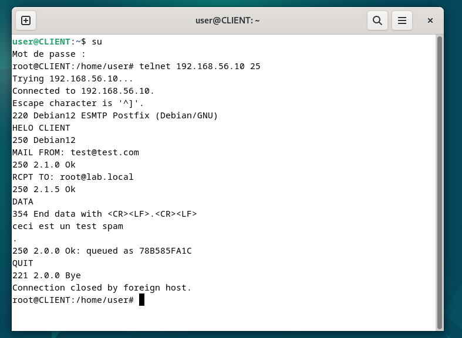
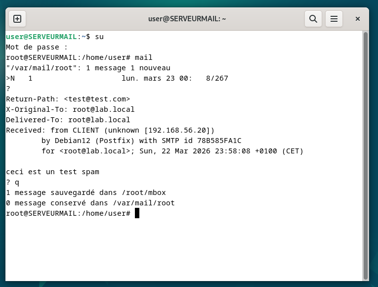
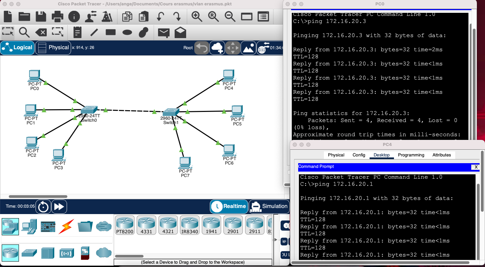
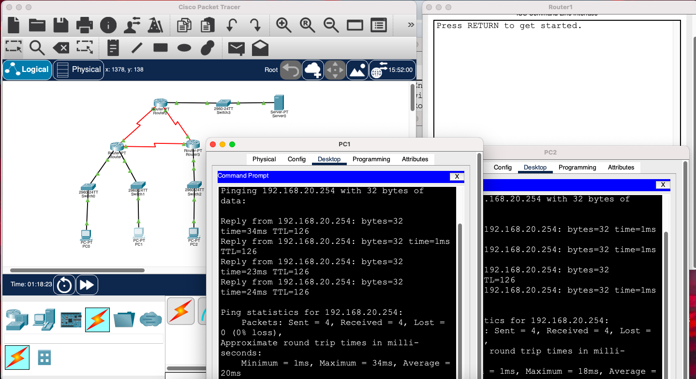
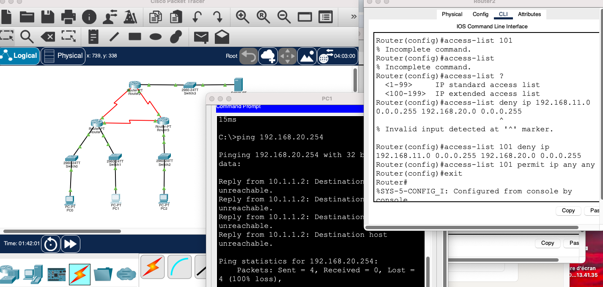

# Fabienne Ange Jazet Tonleu

**Étudiante en Cybersécurité & Administration systèmes** 
> *"J'attaque pour mieux défendre. Je documente pour mieux progresser."*

---

## 📌 À propos de moi

Avec un parcours centré sur la sécurité des systèmes et la détection d'intrusion, je souhaite intégrer votre entreprise en alternance ou stage pour renforcer votre défense et participer à la sécurisation de votre infrastructure.

J'ai déjà réalisé deux stages :
- **Camaroes SARL** : audit de sécurité, tests de vulnérabilité
- **Africa Technology System** : développement d'une solution de suivi de flottes

En parallèle, je construis mon propre laboratoire technique à la maison (VMs Linux, Kali, Debian) pour maîtriser la sécurité offensive et défensive. Ce portfolio rassemble mes projets personnels.

📫 **Contact** : angejaz59@gmail.com | 07 53 42 33 98  
🔗 **GitHub** : [github.com/Ange-fabi](https://github.com/tonpseudo)  
🔗 **LinkedIn** : [linkedin.com/in/fabienne-ange-jazet-tonleu-8197453b4](https://www.linkedin.com/in/fabienne-ange-jazet-tonleu-8197453b4)
🌐 **CV** : [télécharger mon CV](./Fabienne-Ange-Jazet.pdf)

---

## 🛠️ Compétences techniques

| Domaine | Technologies |
|---------|--------------|
| **🐧 Linux** | Debian, Ubuntu, administration serveur, SSH, systemd, nftables, Postfix |
| **🔐 Cybersécurité** | Hydra (brute force), Fail2ban, Nmap, détection d'intrusion, anti-spam |
| **🖧 Réseau** | TCP/IP, VLANs, ACLs, RIP, DNS, DHCP, SMTP, HTTP |
| **💻 Programmation** | C, C# (Unity), Bash, Git |
| **🧪 Virtualisation** | VirtualBox, Kali Linux, laboratoire isolé |

---

## 📁 Projets

### 1. 🔐 Brute force Hydra + contre-attaque Fail2ban
*Attaque et défense sur serveur web Apache*

**Objectif** : Simuler une attaque par dictionnaire, puis mettre en place une défense automatique.

**Actions réalisées** :
- Création d'un dictionnaire de 10 000 mots (4 chiffres) avec `crunch`
- Attaque Hydra sur une authentification HTTP Basic
- Découverte du mot de passe : `1234`
- Configuration Fail2ban (jail `http-auth`) → bannissement de l'IP après 3 échecs

**Résultats** :
- IP `192.168.1.20` bannie
- 2618 tentatives échouées bloquées




---

### 2. 📧 Serveur mail Postfix (SMTP brut)
*Comprendre le protocole SMTP sans client mail*

**Objectif** : Interagir directement avec un serveur mail en ligne de commande.

**Actions réalisées** :
- Installation de Postfix sur Debian 12
- Envoi d'email via session `telnet` (port 25)
- Dialogue SMTP manuel : `HELO`, `MAIL FROM`, `RCPT TO`, `DATA`
- Vérification de la réception avec la commande `mail`

**Résultat** : Email "ceci est un test spam" reçu dans la boîte locale.




---

### 3. 🔍 Détection d'intrusion + firewall nftables
*Durcissement et monitoring réseau*

**Objectif** : Configurer un firewall restrictif et détecter les scans.

**Configuration nftables** :
``` nft
table inet mon_filtre {
    chain input {
        type filter hook input priority filter; policy drop;
        icmp type echo-request accept
        ct state established,related accept
    }
}
```
# Détection :

- Scan Nmap depuis Kali (ports filtrés)
- Logs kernel avec mentions INTRUSION_DETECTEE
- Tentatives SYN sur ports variés (1132, 5002, 2047, 1310, 6580...)


## 4. 🌐 Infrastructure réseau multisite (Cisco Packet Tracer)
Routage et segmentation

**Technologies mises en œuvre :**
- VLANs (création, affectation des ports)
- Trunk (802.1Q) 

**Compétences validées :** Configuration d'équipements Cisco, isolation des flux, gestion d'adressage IP.



### 5. 🌐 Routage et ACLs (Cisco Packet Tracer)
*Contrôle d'accès réseau et filtrage*

**Objectif** : Permettre ou bloquer la communication entre deux réseaux VLANs à l'aide d'une ACL (Access Control List).

**Configuration réalisée** :
- Mise en place d'un routage entre réseaux 
- Vérification initiale : les deux PC (PC1 et PC2) peuvent ping le serveur
- Configuration d'une ACL étendue (numéro 101) pour bloquer le réseau 192.168.11.0/24 vers 192.168.20.0/24
- Application de l'ACL sur l'interface du routeur

**Résultats** :
- **Avant ACL** : ping réussi (Reply from 192.168.20.254)
- **Après ACL** : "Destination unreachable" pour le PC du réseau 192.168.11.0




**Compétences validées** :
- Routage inter-VLAN
- ACLs étendues (access-list 100-199)
- Filtrage de trafic IP
- Cisco Packet Tracer
## 6. 🖧 Serveur DNS (Bind9)
Résolution de noms interne

**Configuration réalisée :**
- Serveur DNS maître sur Debian
- Zones forward et reverse
- Résolution de noms pour un réseau local

```bind
$TTL       604800
@          IN  SOA   DNS.apero.local. root.apero.local. (
                    2         ; Serial
                    604800    ; Refresh
                    86400     ; Retry
                    2419200   ; Expire
                    604800 )  ; Negative Cache TTL
           IN  NS    DNS.apero.local.
           IN  A     192.168.1.1
client     IN  A     192.168.1.2
DNS        IN  A     192.168.1.1
```


---

# 🎓 Formations

| Diplôme | Établissement | Année |
|---------|--------------|-------|
| 1re année cycle ingénieur du numérique (bac+3) | ESAIP, Angers | 2025-2026 |
| Tronc commun cycle ingénieur | ENSPD, Douala | 2023-2025 |
| Baccalauréat | Douala, Cameroun | 2022 |

## MOBILITÉ INTERNATIONALE

**Programme Erasmus** – Université lucian blaga (Roumanie) – 2025-2026
- Master I embedded system and Master I IA (en cours) 
- Adaptation à un nouveau système éducatif et culturel
- Cours en anglais, environnement international

# 🌍 Langues

- **Français :** Natif
- **Anglais :** Intermédiaire avancé
- **Allemand :** Notions de base

# 🤝 Engagements

- Bénévole COP 1 – Angers

